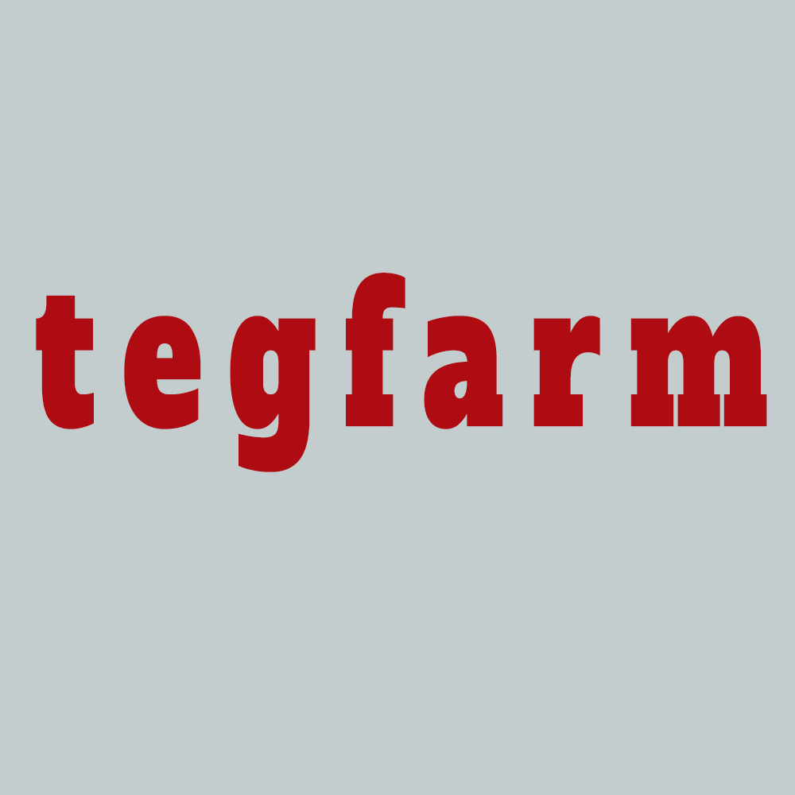
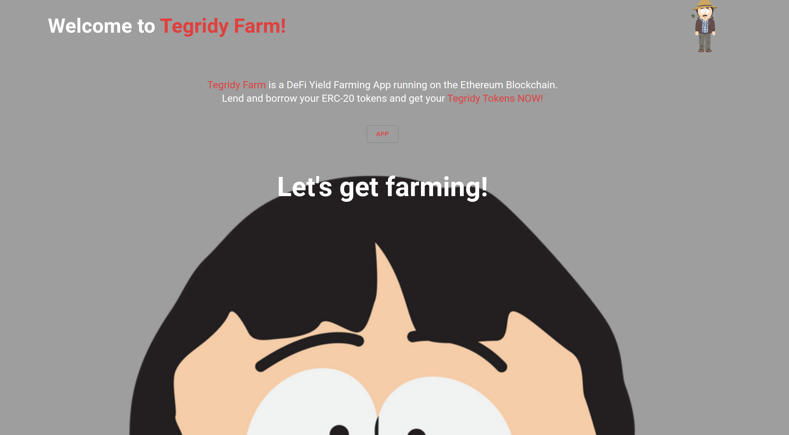
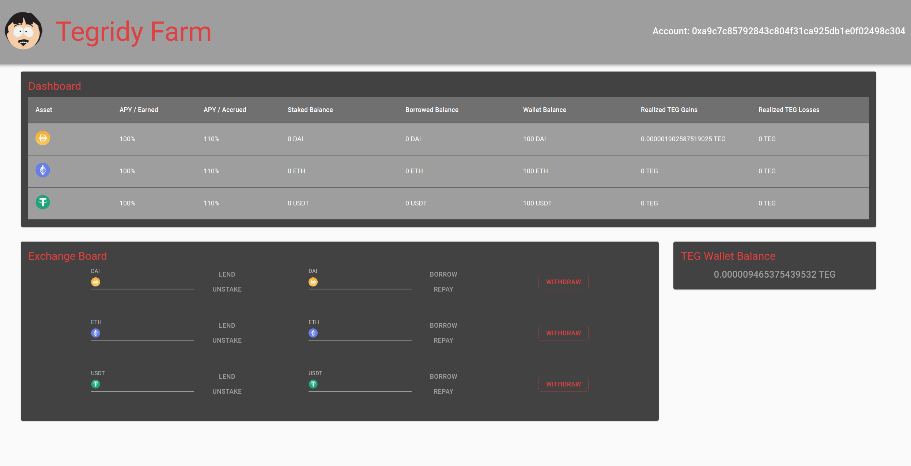

<br/><br/>

Tegfarm is a DeFi Yield Farming App running on the Ethreum Blockchain.<br/> 
Tegfarm allows users to deposit and borrow ETH, DAI and USDT and get interest in TEG token in return.
<br/><br/>

## Screenshots


<br/><br/>

<br/><br/>


## Getting started

Except for the regular suspects - git, Node, npm, etc - you need these things to run the Tegfarm app. Follow the instructions supplied below before you continue with *Installation*.
* Moralis. Subscribe to Moralis [here](https://moralis.io/) and provide the app ID and server link in the .env file (see .env.example) 
* Make sure you install Truffle [here](https://www.trufflesuite.com/) as well as Ganache [here](https://www.trufflesuite.com/ganache) to have a local blockhain running. On Ganache, you will have 10 accounts that you can use to interact with the SMART contracts in the application.
* Install Metamask for your browser [here](https://metamask.io/) and connect it to the **second** account you see listed on Metamask. The first one will be used to deploy the smart contracts on the blockchain and should not be used. 

## Installation
1. Clone this repo and enter!

   ```bash
   git clone https://github.com/frankperler/yieldfarm.git
   cd yieldfarm
   ```
2. Install dependencies, by running ````npm install````

3. Add Moralis' key and server link as listed in the .env.example file.

4. In the **client**, open the terminal and run in this order:
      * truffle compile 
      * truffle migrate --reset
      * npm start
      
5. Open your browser and you should see the landing page of Tegfarm
 
 ## Tech Stack
 [React](https://reactjs.org/), [Material-UI](https://material-ui.com/), [Solidity](https://docs.soliditylang.org/en/v0.8.7/#), [Web3.js](https://web3js.readthedocs.io/en/v1.4.0/), [Truffle](https://www.trufflesuite.com/), [Ganache](https://www.trufflesuite.com/ganache), [Moralis](https://moralis.io/)
 
 ## Developer
 
 * Frank Perler - [GitHub](https://github.com/frankperler) - [LinkedIn](https://www.linkedin.com/in/frank-perler/)
